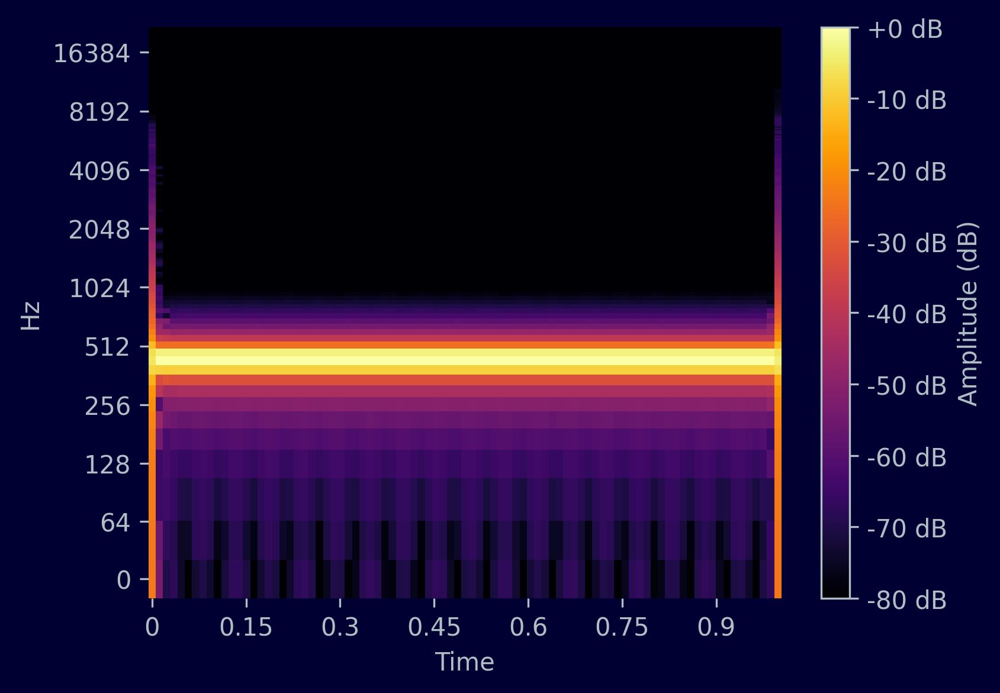
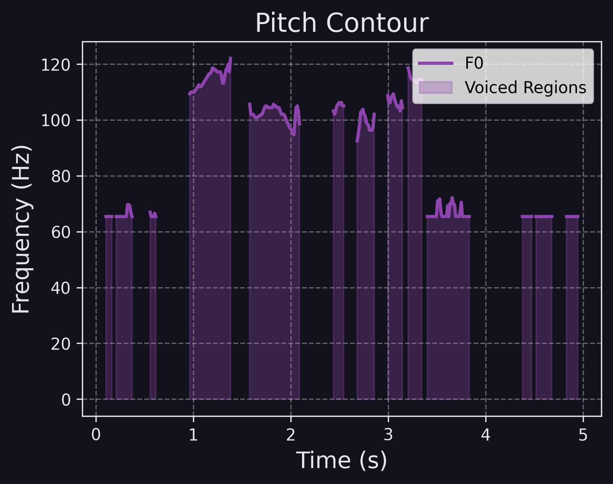
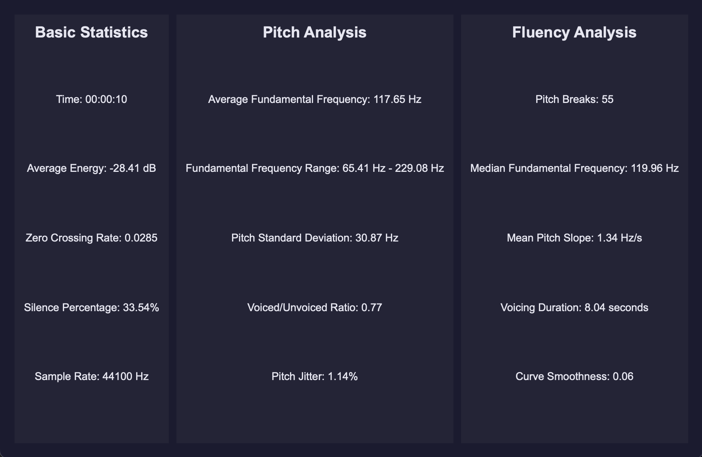

# 🎛 SignalBox - Audio Spectrogram & Voice Analysis Tool

SignalBox is a macOS desktop application that visualizes audio spectrograms, pitch contours, and speech-related analysis metrics from microphone recordings or uploaded audio files. It processes input after recording or selection (not in real time).

---

## ✨ Features

- **Spectrograms**: View full-spectrum audio analysis after loading or recording.
- **Pitch Contours**: Extract and display fundamental frequency (F0).
- **Voice Analysis Tools**: Evaluate speech characteristics such as voicing, pitch dynamics, and contour consistency.
- **Mic & File Input**: Supports `.wav`, `.mp3`, `.flac`.
- **Adjustable Settings**: Modify FFT size, hop length, and color map.
- **Modern GUI**: Built with PySide6 using modular page layout.

---

## 🚀 Setup (macOS)

### Prerequisites

- macOS 12+
- Python 3.11 or 3.13
- Git, pip

### Steps

```bash
git clone https://github.com/LucaSSpadoni/SignalBox.git
cd SignalBox
python3 -m venv venv
source venv/bin/activate
pip install -r requirements.txt
python3 main.py
```

---

## 📸 Example Output

> Replace these placeholders with real screenshots when ready

### 🎙 Spectrogram View


### 📈 Pitch Contour Overlay


### 📊 Analysis Metrics Panel


---

## 🧰 Tech Stack / Libraries Used

- **PySide6** – Qt-based Python GUI framework
- **librosa** – Audio analysis and feature extraction
- **numpy** – Numerical array processing
- **scipy** – Signal processing tools
- **matplotlib** – Plotting and visualization
- **soundfile** – Audio file reading/writing
- **pyaudio** – Microphone input capture
- **sklearn** – Used for metrics like R² score

---

## 🪪 License

MIT License — see `LICENSE` for details.

